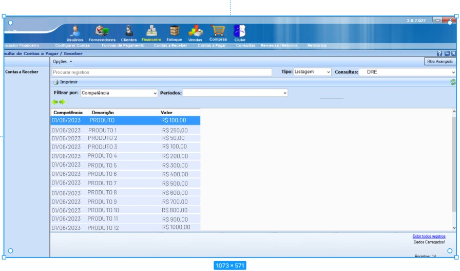
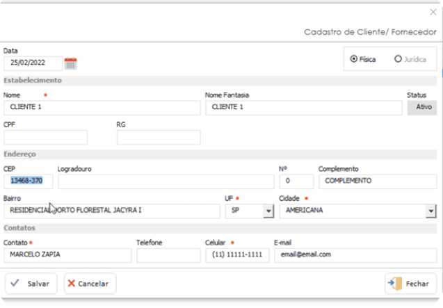
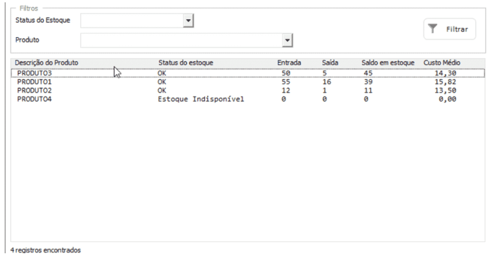

# TrabENGSIII

## Proposta

- A proposta do projeto, é criar uma aplicação para comportar os funcionamentos necessarios para uma lója física de vestuários.
- Possuindo as seguintes funcionalidades:
  - Gerenciamento de estoque
  - Geração de relatórios
  - Controles de acesso
  - Emissão de documentos fiscais

## Pré requisitos

- O pré requisito para o uso do sistema são:
  - Possuir uma conta ativa para alguma das lojas parceiras.
  - Possuir um browser com versão superior, a minima compátivel com a aplicação.

## Sobre

- Projeto construido para a disciplina de Engenharia de Software III, da PUC Minas, no curso de Ciência da computação.

### Professor

- Luiz Alberto Ferreira Gomes

### Alunos:

- João Paulo Bertozzi Valdomiro
- Octavio Silva Santana
- Raphael Siqueira Prince
- Temístocles Altivo Schwartz
- Thiago Fonsato Alves

### wireframes na ferramenta Figma para as cinco primeiras histórias:
1- Eu como vendedor gostaria de ter acesso a todos os produtos disponíveis na loja (e aos seus dados)para poder vendê-los aos meus clientes:

2- Eu como gerente gostaria de poder ter acesso à todos os meus funcionários, podendo gerenciar a criação, manutenção dos seus dados e poder desativá-los quando necessário

3 - Como caixa gostaria de poder registrar todas as vendas passadas pelos clientes com precisão, para que ao final do dia todos os dados estajam batendo corretamente

4 - Gostaria de poder efetuar o cadastro dos clientes no sistema, para que as vendas possam ser vinculados ao seu cadastro

5 - Eu como estoquista gostaria de poder registrar no sistema todas as entradas de produtos para poder disponibilizar a quantidade em estoque para os vendedores

### Descrição de classes de dominio

| História                                                                                                                                                                 | Classe               |
|--------------------------------------------------------------------------------------------------------------------------------------------------------------------------|----------------------|
| Eu como vendedor gostaria de ter acesso a todos os produtos disponíveis na loja (e aos seus dados)para poder vendê-los aos meus clientes                                 | SalesmanListProducts |
| Eu como gerente gostaria de poder ter acesso à todos os meus funcionários, podendo gerenciar a criação, manutenção dos seus dados e poder desativá-los quando necessário | AbleEmployee         |
| Eu como gerente gostaria de poder ter acesso à todos os meus funcionários, podendo gerenciar a criação, manutenção dos seus dados e poder desativá-los quando necessário | DisableEmployee      |
| Eu como gerente gostaria de poder ter acesso à todos os meus funcionários, podendo gerenciar a criação, manutenção dos seus dados e poder desativá-los quando necessário | ListEmployees        |
| Eu como gerente gostaria de poder ter acesso à todos os meus funcionários, podendo gerenciar a criação, manutenção dos seus dados e poder desativá-los quando necessário | UpsertEmployee       |
| Como caixa gostaria de poder registrar todas as vendas passadas pelos clientes com precisão, para que ao final do dia todos os dados estajam batendo corretamente        | RegisterSale         |
| Gostaria de poder efetuar o cadastro dos clientes no sistema, para que as vendas possam ser vinculados ao seu cadastro                                                   | CreateClient         |
| Eu como estoquista gostaria de poder registrar no sistema todas as entradas de produtos para poder disponibilizar a quantidade em estoque para os vendedores             | RegisterProducts     |

|
WireFrame 1
|
WireFrame 2
|
WireFrame 3
|
WireFrame 4
|
WireFrame 5
|
|--|--|--|--|--|
| Tabela de todos os produtos e preços | Quadro de gerenciamento de funcionários | Sistema de caixa com registro completo de vendas | Sistema de cadastro de clientes | Sistema logístico para controle de entrada e saída de produtos |
